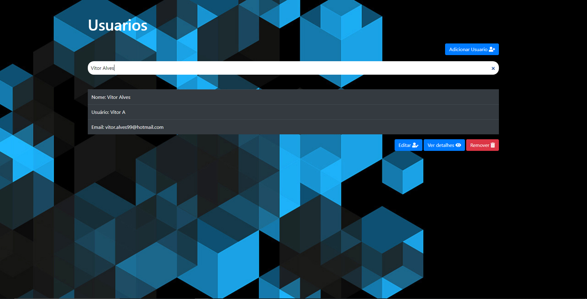
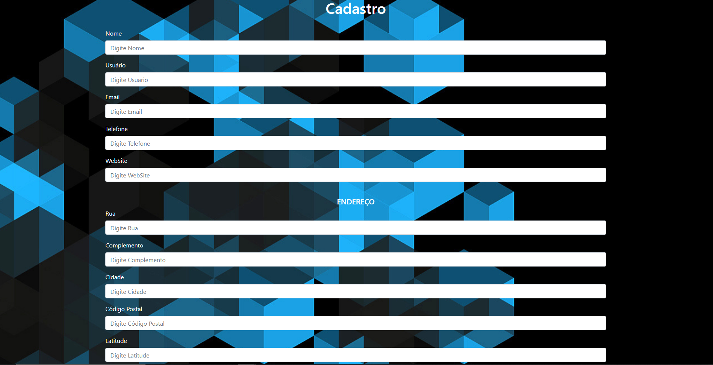
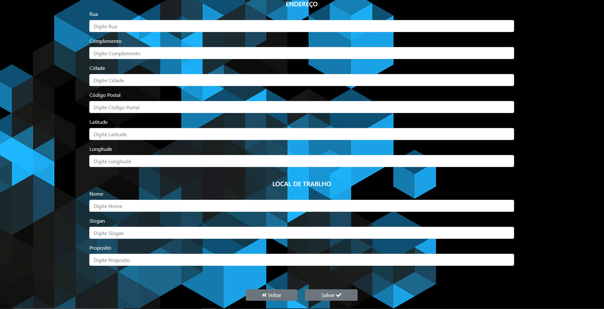
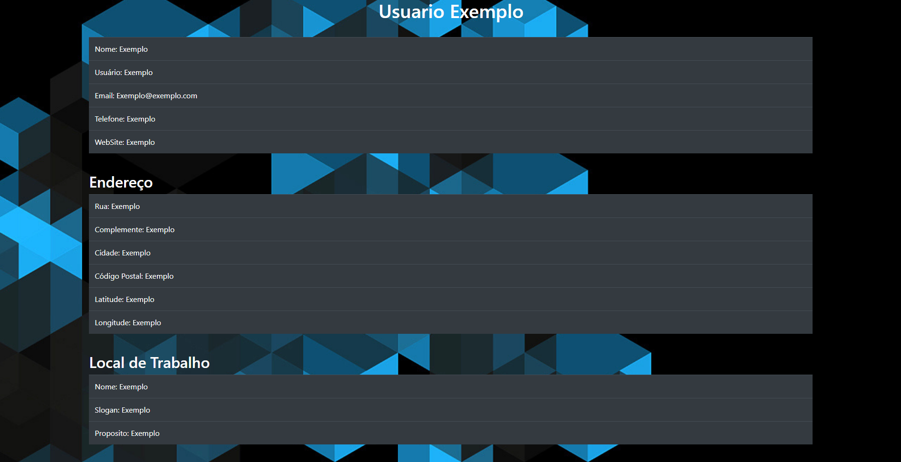

# Aplicação - CRUD de usuários

<h2>Repositório que consiste em um site de usuários implementado em Vue, consumindo uma api em Node(também feita por mim).</h2> 
<br>

# .Home

<p>- Tela de listagem dos Usuários cadastrados, mostrando informações resumidas em ordem do mais recente primeiro.</p>
<h3>Ações - Home</h3>
<p><b>Filtro:</b> Input para filtragem dos usuários</p>
<p><b>Adicionar Usuario:</b> Quando clicado, será direcionado pra tela de cadastro</p>
<p><b>Editar:</b> Quando clicada, será direcionado para a tela de cadastro, já preenchida com as suas
informações, podendo alterar informações de tal usuário.</p>
<p><b>Remover:</b> Quando clicada, aparece a confirmação e se confirmada, deletará o usuário
do banco de dados e da Home.</p>
<p><b>Ver detalhes:</b> Irá para uma página separada com todos os dados do usuário
cadastrado.</p>

<div align="center" style="margin-top: 15px;">
  
</div>

<br>
<br>
<br>

# .Filtro
<p>- Na página Home existe um input para Filtragem dos usuários, que atualiza os
usuários a cada caracter colocado ou apagado.</p>

<div align="center" style="margin-top: 15px;">
  
</div>

<br>
<br>
<br>

# .Cadastro
<p>- Tela com formulário para cadastramento de usuários, você deve preencher os campos do seu usuário(Há validação para que não deixe salvar em branco os 5 primeiros campos), depois de escrever você pode salvar(Listará e voltará para a página Home) ou voltar(Irá para a página Home sem salvar).</p>

<div align="center" style="margin-top: 15px;">
  
</div>
<br>
<div align="center" style="margin-top: 15px;">
  
</div>

<br>
<br>
<br>

# .Informações detalhadas
<p>- Tela que mostra todas as informações de determinado usuário cadastrado.</p>

<div align="center" style="margin-top: 15px;">
  
</div>

<br>
<br>
<br>
<br>

<h2>Ferramentas utilizadas</h2>
<ul>
  <li>Inicializei o projeto com Vue-cli webpack simple.</li>
  <li>Bootstrap e Vue-Bootstrap para melhoria visual do site.</li>
  <li>Vue-router para criar rotas no site, assim sendo realmente uma Single Page Aplication.</li>
  <li>Babel para conseguir usar os novos padrões do JS.</li>
  <li>cross-env para ter um único comando sem se preocupar em definir ou usar a variável de ambiente.</li>
  <li>WebPack para empacotar códigos.</li>
</ul> 

<br>

## Build Setup

``` bash
# install dependencies
npm install

# serve with hot reload at localhost:8080
npm run dev

# build for production with minification
npm run build
```

For detailed explanation on how things work, consult the [docs for vue-loader](http://vuejs.github.io/vue-loader).
